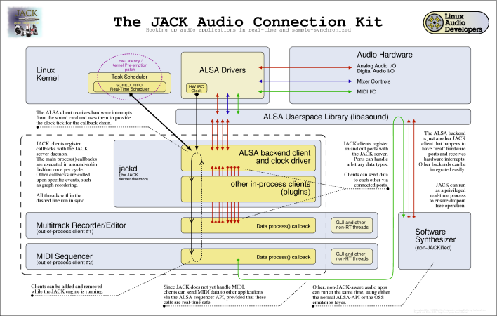

:keywords: JACK, design, jack-audio-connection-kit
:docinfo: private-header
:toc:

= JACK Design Documentation

Kai Vehmanen, Andy Wingo, Paul Davis

27 August 2003

This historical document was recreated from link:https://web.archive.org/web/20080221160709/http://jackit.sourceforge.net/docs/design/[http://jackit.sourceforge.net/docs/design/ (via archive.org)]

== General

=== Introduction

In April 2001, people on the link:https://lists.linuxaudio.org/postorius/lists/linux-audio-dev.lists.linuxaudio.org/[linux-audio-dev mailing list] [lad] began
to see the need for system that would allow high-bandwidth, low-latency,
sample-synchronized data transfer between independent audio applications. Such a
system would necessarily offer robust performance, even on highly stressed
systems. Discussions on the nature of the project, nicknamed LAAGA (the ``Linux Audio Application Glue API'') [laaga], continued until the fall. A sample
implementation, derived from the source code of Ardour [ardour], came to be
known as Jack, an acronym for ``Jack Audio Connection Kit''. Jack has largely
achieved the goals of LAAGA, although it is still under development. This
document offers a retrospective look at the problems facing audio development on
Linux, and was initially written by Kai Vehmanen for LAAGA. It has been adapted
with his permission.

=== Document Scope and Status

It is important to note that this document is not complete nor it is
100% accurate description of JACK's design. For a complete view you 
have to combine information from this document, source code, Doxygen
documentation embedded to the sources and jackit-devel mailing list
archives. This is not an optimal situation, but reflects the
distributed nature of JACK development. In any case, this document
still provides lots of valuable information for your use.

=== What we're aiming at--an example use case

Let's say you are using a multitrack recorder/mixer. It's working nicely on your
Linux box. You can record and mix without problems. But now you've found a
couple of interesting new apps, let's say a software synth and a virtual drum
machine. They seem to work great, so why not use them in your recordings? But
how to connect them to the multitrack recorder?

Now that's the big problem, because you can't. Or at least not in a easy,
reliable way. This is the problem JACK aims to resolve.

=== Document history

.Document history
* 21.12.2023 - Convert to AsciiDoc. Nedko Arnaudov
* 27.08.2003 - Added Paul's explanation of graphs and subgraphs to
                   the implementation notes chapter, link to Jörn's 
		   JACK schematic diagram and a few viewcvs weblinks. 
                   Reorganized the problem description section a bit. 
                   Added the ``Document Scope and Status'' note. Kai Vehmanen
* 29.01.2003 - Added lots of entries to the bibliography. Kai Vehmanen
* 29.01.2003 - Added the ``Architecture Description'' section. Kai Vehmanen
* 29.01.2003 - Added the ``Implementation Notes'' section. Kai Vehmanen
* 04.01.2002 - Various updates. Andy Wingo
* 16.12.2001 - Typo fixes. Andy Wingo
* 16.12.2001 - Initial version. Kai Vehmanen

== Design aims

=== Constraints and requirements
.Following is a list of constraints and requirements that JACK aims to fulfill.
* Jack should allow streaming of low-latency, high-bandwidth data between
  independent applications.
* Although not a requirement, Jack should support any streaming data type,
  not just audio.
* In an active Jack setup, there will be one server and one or more Jack
  plugins. It will be possible to run multiple Jack servers, but each server will
  form an independent Jack setup. Jack will not define any interfaces between Jack
  servers.
* Applications connected using Jack may have their own graphical interfaces.
  Jack will not make any specifications as to different GUI toolkits or
  libraries. As a consequence of this requirement, different parts of a
  running Jack setup may be spread across multiple processes.
* Jack should provide full, sample accurate synchronation (ie. totally
  synchronous execution of all client plugins)
* To represent audio data, Jack should use 32 bit IEEE floats, 
  normalized to value range [-1,1].
* Only noninterleaved audio streams will be supported.
* One Jack client may consume or produce multiple data streams.
* The Jack API should be specified in ANSI C. There are no restrictions on
  how servers and clients are to be implemented.
* It should be possible to connect already running applications.
* It should be possible to add or remove Jack clients while the server is
  running.

== Problem Description

=== Key Issues in Audio Application design

==== Realtime Requirements Imposed by Audio Hardware

Basic constraints that affect audio application design come from the audio
hardware level. At some point in time, the soundcard is started. After this, the
audio application must transfer audio data to the device at a constant speed in
order to avoid buffer underruns and overflows. This behaviour is sometimes
described as running at real-time speed. Some headroom is available, as all
soundcards have room for at least a few audio blocks. Here the term block refers
to the amount of data processed per one hardware interrupt. The soundcard's
driver software usually implements another layer of buffering. But every time we
add buffering, independently from the implementation level, we are also adding
delays to the signal path.

==== Keeping the Audio Device Buffers Full

But this headroom is not necessarily enough. In modern, pre-emptive operating
systems, a normal user application doesn't have exclusive access to hardware
resources. This means that the application gets to run at certain, not
necessarily even, intervals. From audio application's point of view, it's
critical that it gets a chance to communicate with the audio device often
enough. Like all applications with real-time restrictions, audio applications
can't do much transfer in advance, and they can't lag much behind.

==== Scheduling and System Calls

Most operating systems that implement the POSIX [posix1003.1] specification
provide means to run processes with so-called real-time scheduling. In practice
this means that once a process gets to run, it can keep the processor until
either it is blocked by an I/O request, it loses the processor to a higher
priority real-time process, a hardware interrupt occurs, or it willingly gives
the processor up.

One very efficient way of implementing audio applications is having one
real-time scheduled thread or a process that handles all soundcard I/O. But even
with this approach, there are a number of pitfalls. Allocating memory with
standard system services is not a deterministic operation. In other words it's
not predictable how much one allocation takes time as it's not a direct function
of the amount of requested memory.

The same applies to many system services such as accessing files, network
devices, and so on. Implementing the audio thread needs very careful planning.
When the audio thread needs to communicate with other software modules, various
nonblocking techniques like read-writer locks [readwriterlocks] are
required. Most of these rely on atomic operations and shared memory.

=== Problems in Combining Audio Software Components

==== Overview

Modularization is a central concept in computer science. It's easier to handle
complex problems by dividing them first into smaller components. Small
components have also proved to be powerful building blocks. Good examples of
this are the standard UNIX text processing tools. They are simple, yet powerful.

The same approach should also be useful for processing audio data. In practice,
however, this has proved to be very difficult to implement. There are numerous
audio servers and application frameworks available, but nearly all them have
serious problems when it comes to latency and bandwidth considerations. The
basic problem is that all common mechanisms for process-to-process communication
(IPC) involve possibly blocking system calls. This is especially true for
network operations. These problems can be avoided to some degree by increasing
the buffersizes. But this will also increase the signal path delay. And the more
bandwidth is needed, the more restricting this limitation becomes.

For instance, if some client application offers its user a possiblity to
interact in real-time with the audio generation process, the delay in audio
output must not reach 5ms. After this limit, some people start noticing a delay
between actions and the resulting audio. If the processed signal is to be
combined with the original signal, a 'comb filter' effect will begin to be heard
at latencies above about 3 ms. In summary, the scheduling requirements for a
low-latency system are quite tight, which requires a solid design from the
beginning.

==== Multi-Process Approach

Now if we have multiple processes (programs) producing audio data, and one
process that is handling all communication with the audio hardware,
then we need some form of inter-process communication (IPC). There are
however two possible problems with this approach: process switching
overhead and performance problems in IPC mechanisms.

Let's say that we have 5 processes producing audio, and one of them handles the
audio hardware I/O. To avoid buffer underruns, during one hardware interrupt
cycle, all 5 processes must have enough processor time to produce the next block
of audio data. The more processes are involved, the higher the process switching
overhead becomes. It also becomes increasingly difficult to adjust the relative
priorities of different processes. If only one process fails to produce its
audio fragment, a buffer underrun can occur.

In the above it is assumed that transferring data between processes doesn't have
any extra cost. This is of course not true. All IPC mechanisms cause some
overhead, although some of them (especially shared memory) are very efficient.
Here the cost comes primarily from process synchronation.

One way to avoid the possible IPC troubles is to locate all audio producing code
into the audio engine process (audio engine refers to the process, or more
specifically the thread, responsible for audio hardware i/o). Clients could be
loaded as plugins into the engine. However, this approach has its own problems.

==== Scheduling of Clients in Multi-Process Scenario
If we choose to go with all the multi-process approach, where all
clients are out-of-process, we have another problem to contend with.
Each client will be told by the engine when it is time to operate on
its data. If the client then ``returns'' to the engine after every
process cycle, many context switches will occur, causing increased latency or
possible dropouts. Clients will have to be notified of shared memory locations,
but this is not a big problem. The largest problem is how to communicate between
the server and the client. There are two choices on a POSIX system, signals and
polling on UNIX sockets.

==== Single-Process Approach
The biggest problem of this approach is the increased client side complexity.
Client applications must be divided into realtime critical (audio
producing/consuming) and non-realtime parts (user interfaces, network and file
i/o, etc). The critical parts are loaded to the server process as plugins, while
the non-critical part run in a separate lower priority process. Some kind of IPC
is also needed between the realtime and non-realtime parts of the client. To
make things even more difficult, care must be taken that this communication
never blocks the realtime critical process.

Another interesting question is how different types of applications can take
advantage of this plugin-based approach.

== Architecture Description

=== Overview

=== Modules

==== Jackd - the JACK Server

link:https://raw.githubusercontent.com/jackaudio/jack1/master/jackd/jackd.c[jackd.c]

===== Engine Core

link:https://raw.githubusercontent.com/jackaudio/jack1/master/jackd/engine.c[engine.c]

==== Driver Interface

link:https://raw.githubusercontent.com/jackaudio/jack1/master/include/driver.h[driver.h]

=== Libjack - the JACK Client Interface

link:https://raw.githubusercontent.com/jackaudio/headers/master/jack.h[jack.h]

== Implementation Notes to Developers

=== Real-Time Considerations When Implementing JACK Clients

==== Implementing the Callbacks</a>

The jack_process() callback provided by each client is required 
to be real-time safe. In other words its code must be deterministic
and not involve functions that might block for a long time. These
functions are for example malloc, free, printf, pthread_mutex_lock,
sleep, wait, poll, select, pthread_join, and pthread_cond_wait.

==== Communication Between Application Threads

As the jack_process() must not contain any blocking
function calls or other non-deterministic code, you have to be 
extra careful when implementing communication between your
jack_process() callback and other application threads.

For a practical example, see the the source file capture_client.c
that is distributed along with the JACK package. It contains
one example of non-blocking communication.

=== JACK Graphs and Subgraphs

Graphs are an idea/abstraction that is widely used in 
DSP programming.

A graph is a set of connected "nodes", each of which must be
"executed" on a periodic basis. In the case of JACK, the graph is made
up of JACK clients, and we need each one to have its process()
function called in a specific order. The connections between each node
may take any configuration whatsoever. JACK has to serialize the
execution of each client so that the connections represented by the
graph are honored (e.g. client A sends data to client B, so client A
should execute before client B).

Subgraphs are a JACK specific term that cover portions of the overall
graph. Specifically, a part of the serialized execution order bounded
by either of (i) one end of the serialized order or (ii) an in-process
client. Subgraphs are important in JACK because they represent 
out-of-process clients that will drive the execution of the next
client in the subgraph. rather than switch to a client, then back to
the server, and so on, we instead arrange the subgraph so that each 
client drives the execution of the next client till the last one 
returns control to the server. This is *much* more efficient than the
out-and-back-per-client design.

So, a moderately complex graph might look like:

----
    A(I) 
    B(O)  |  subgraph
    C(O)  |    one
    D(I)
    E(O)  |
    F(O)  |  subgraph
    G(O)  |   two
----

The (I) or (O) designates whether client A-G is in- or
out-of-process. In this case, our execution pattern is like this:

----
    A->process(); // direct function call 
    start subgraph one by telling B to call its process function
       B tells C
       C returns to the server
    D->process(); // direct function call
    start subgraph two by telling E to call its process function
       E tells F
       F tells G
       G returns to the server.
----

== Bibliography

.Bibliography
alsa::
 Advanced Linux Sound Architecture, http://www.alsa-project.org, Nov. 2002

anderson95::
 Anderson, James H., Srikanth Ramamurthy and Kevin Jeffay, Real-time Computing with Lock-Free Shared Objects, ACM Transactions on Computer Systems, Volume 15, Number 2, pp. 134-165, May 1997, \http://citeseer.nj.nec.com/anderson95realtime.html.

ardour::
 Ardour, link:https://ardour.org/[].

carstens00::
 Carstens, Matthias, Low Latency Background: Buffer and Latency Jitter, RME Technical Info, 2002, link:https://web.archive.org/web/20021202223620/http://www.rme-audio.com:80/english/techinfo/lola/latec.htm[http://www.rme-audio.com/english/techinfo/lola/latec.htm (via archive.org)].

cheshire96::
 Cheshire, Stuart, Latency and Quest for Interactivity, White paper commissioned by Volpe Welty Asset Management, L.L.C., for the Synchronous Person-to-Person Interactive Computing Environments Meeting, San Francisco, November 1996, https://web.archive.org/web/20080221160709/http://www.stuartcheshire.org/papers/LatencyQuest.ps[http://www.stuartcheshire.org/papers/LatencyQuest.ps (via archive.org)]

fober02b::
 Fober, D., S. Letz, Y. Orlarey, Lock-Free Techniques for Concurrent Access to Shared Objects, Actes des Journées d'Informatique Musicale JIM2002, pp. 143-150, Marseille, 2002.

jack::
 JACK Audio Connection Kit web site, link:https://jackaudio.org[], \http://jackit.sourceforge.net, Nov. 2002.

laaga::
 Linux Audio Application Glue API, link:https://web.archive.org/web/20090307013119/http://eca.cx/laaga/[http://eca.cx/laaga/ (via archive.org)]

lad::
 Linux Audio Developers' Mailing List, link:https://lists.linuxaudio.org/postorius/lists/linux-audio-dev.lists.linuxaudio.org/[], link:https://web.archive.org/web/20050501181847/http://lalists.stanford.edu/lad/2001/Apr/0157.html[]

macmillan01::
 Macmillan Karl, Michael Droettboom and Ichiro Fujinaga, Audio latency measurements of desktop operating systems, International Computer Music Conference, pp. 259-262, 2001, La Habana, Cuba, \http://gigue.peabody.jhu.edu/~mdboom/latency-icmc2001.pdf

posix1003.1::
 POSIX 1003.1 Standard for Information Technology - Portable Operating System Interface System Interfaces, IEEE Std 1003.1-2001. System Interfaces, Issue 6, December 2001.

readwriterlocks::
 Reader/writer locks, http://www.google.com/search?q=reader-writer+locks&amp;btnG=Google+Search

valois94::
 Valois, John D, Implementing Lock-Free Queues, Proceedings of the 7th International Conference on Parallel and Distributed Computing Systems, Las Vegas, NV, pp. 64-69, October 1994.

sos99::
 Walker, Martin, Dealing with Computer Audio Latency, Sound on Sound Magazine, April, 1999, https://web.archive.org/web/20080904211730/http://www.soundonsound.com/sos/apr99/articles/letency.htm[http://www.soundonsound.com/sos/apr99/articles/letency.htm (via archive.org)].

williams02::
 Williams, Clark, Linux Scheduler Latency, Red Hat Inc., White paper, March 2002, link:https://web.archive.org/web/20071119101431/http://www.linuxdevices.com/files/article027/rh-rtpaper.pdf[http://www.linuxdevices.com/files/article027/rh-rtpaper.pdf (via archive.org)].
